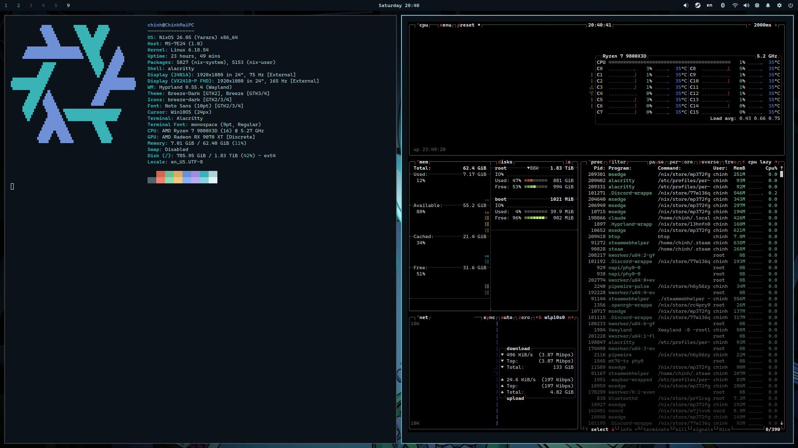
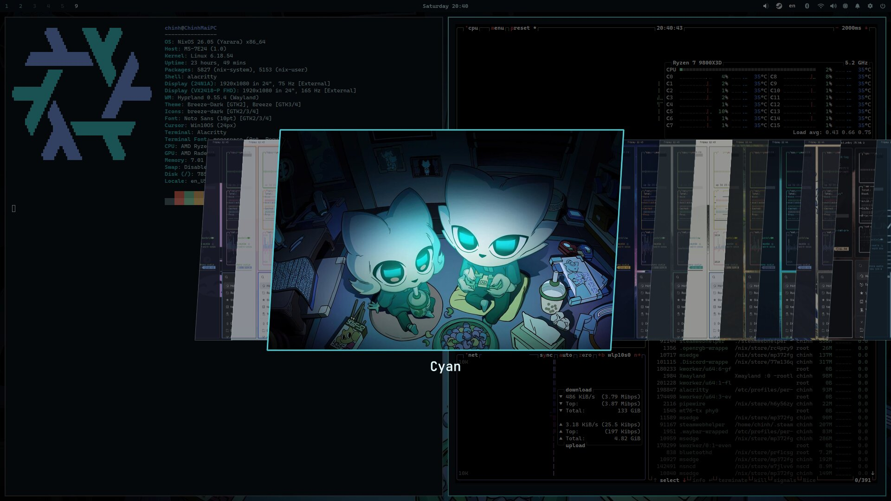
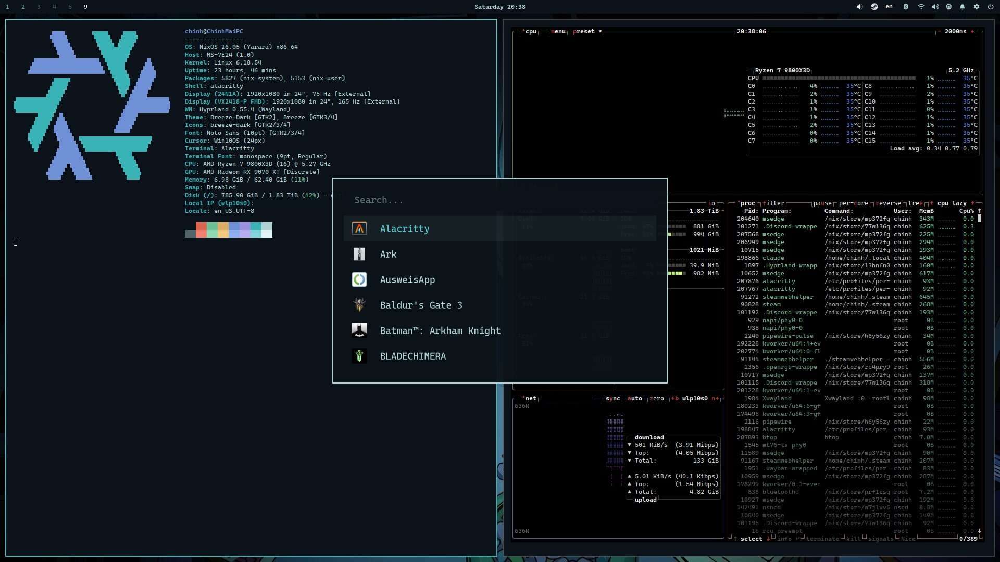
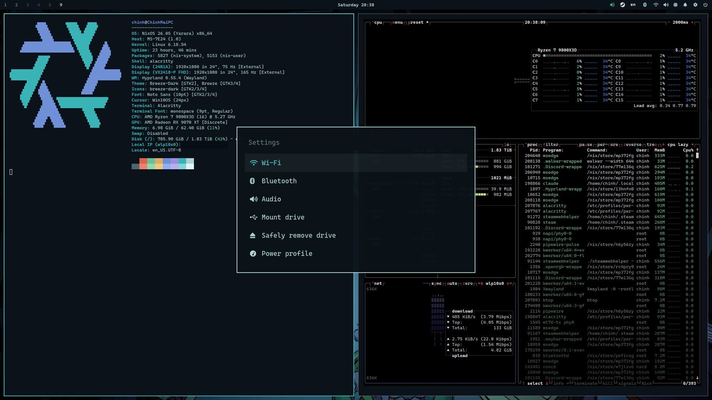
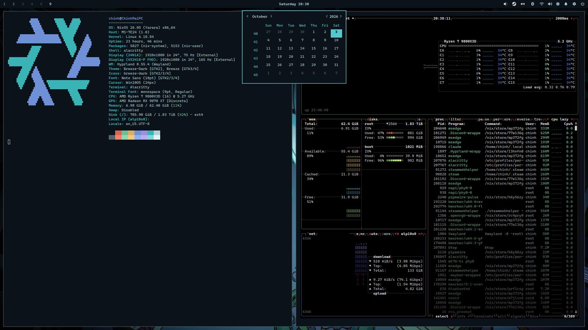
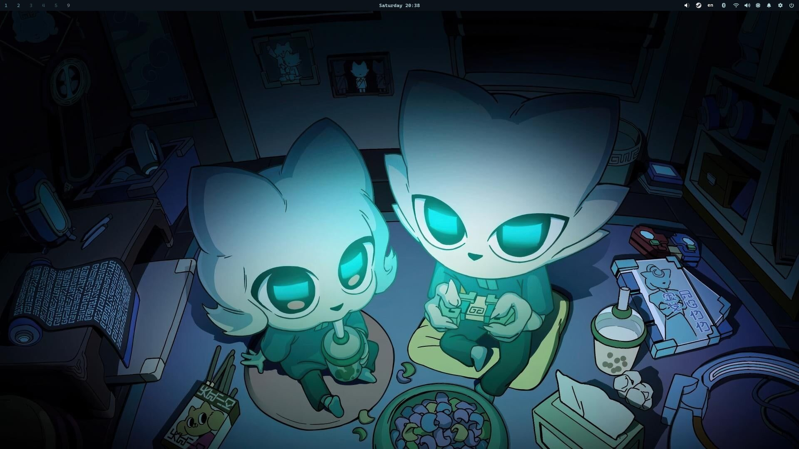
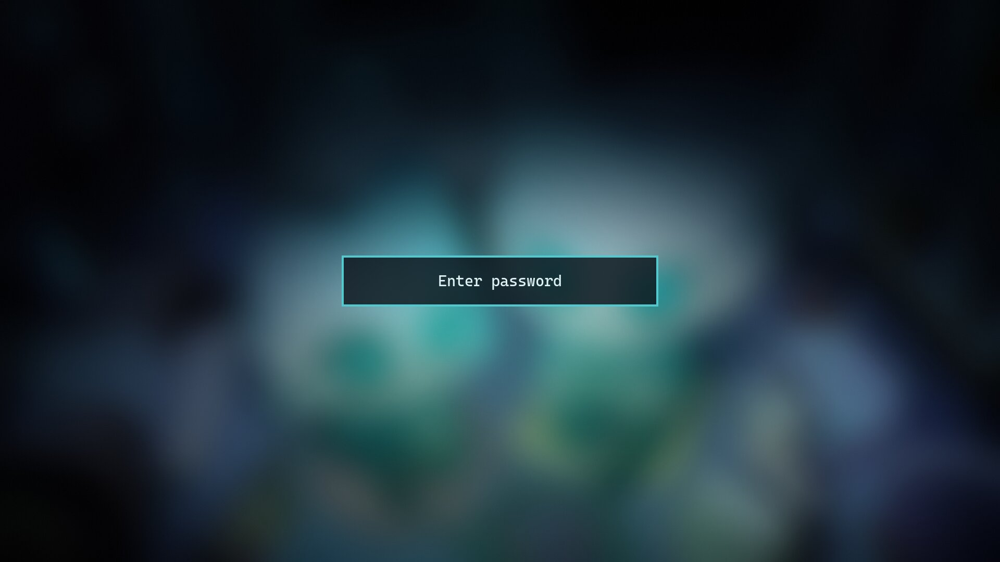

# nixos-config

My desktop PC's NixOS setup: a flake with Home Manager that builds an **Omarchy-style
Hyprland desktop** (themes, carousel pickers, launcher menus, a themed top bar, lock and login
screens), while keeping **KDE Plasma** installed as a fallback session.

It runs daily on an AMD Ryzen 7 9800X3D + Radeon RX 9070 XT desktop with two 1080p monitors
(75 Hz + 165 Hz VRR), NixOS 26.05.



## Screenshots

| | |
|---|---|
|  |  |
| **Theme picker**: Omarchy-style carousel, live switching of all 20+ Omarchy themes plus my own | **App launcher** (Walker) |
|  |  |
| **Settings menu** from the gear icon: Wi-Fi, Bluetooth, audio, drives, power, theme, font, … | **Calendar** from the clock, in the theme's colours and font |
|  |  |
| **Cyan**, my own theme, made from these wallpapers | **Lock screen** (hyprlock) |

## What's in it

**Hyprland session** (`hyprland.nix`, `theme.nix`), modelled on [Omarchy](https://github.com/basecamp/omarchy):

- **Themes:** every theme from Omarchy's repository, turned into colour files for Hyprland,
  Waybar, Walker, Mako, Alacritty and Hyprlock at build time (`theme-generate.py`), plus my
  own in `themes/`. Switching is live; nothing needs a restart.
- **Pickers:** a Quickshell carousel (`picker.qml`) for themes and the current theme's wallpapers.
- **Top bar (Waybar):** workspaces, clock with a calendar popup, tray, Bluetooth, a Wi-Fi menu,
  volume, CPU, a notification bell (history panel with notification actions, right click =
  Do Not Disturb), the settings gear and a power menu.
- **Menus in the launcher (Walker + Elephant):** apps, settings, Wi-Fi (connect, change the
  password, forget a network, …), keybindings, emojis, clipboard, the power menu.
- **Fonts:** a font switcher with a set of Nerd Fonts; it also sets the system-wide monospace font.
- **The rest:** screen recording (gpu-screen-recorder), screenshots (hyprshot), night light
  (hyprsunset), idle lock (hypridle), on-screen volume (SwayOSD), and two layouts per
  workspace (dwindle / scrolling).
- **Login screen:** an SDDM theme based on Omarchy's, with a "Welcome back" message over the
  wallpaper. Hyprland is the default session, and F2 switches to Plasma.

**System** (`configuration.nix`, `home.nix`): AMD graphics, Steam + GameMode + MangoHud,
PipeWire, Bluetooth, printing/scanning, Vietnamese input (fcitx5-unikey), a OneDrive mount
(rclone), KDE Wallet unlocked at login, Ollama on ROCm, and a weekly clean-up that keeps the
3 newest system versions.

Some hardware workarounds are documented in the comments where they're set, e.g. the MediaTek
MT7922 Wi-Fi card on kernel 6.18 LTS, and unmounting OneDrive around sleep.

## Keybindings (highlights)

| Keys | Action |
|---|---|
| `Super + K` | Show all keybindings |
| `Super + Space` | App launcher |
| `Super + Alt + Space` | Settings menu |
| `Super + Escape` | System menu (lock / sleep / log out / restart / shut down) |
| `Super + Ctrl + Shift + Space` | Theme picker |
| `Super + Ctrl + Space` | Wallpaper picker |
| `Super + Return` | Terminal |
| `Super + Q` | Close window |
| `Super + F` / `Super + T` | Full screen / floating |
| `Super + L` | Switch workspace layout (dwindle / scrolling) |
| `Super + 1…0` | Workspaces |
| `Print` / `Alt + Print` | Screenshot of an area / start-stop screen recording |
| `Super + Ctrl + ,` | Do Not Disturb |
| `Ctrl + Space` | Switch input language |

## Files

```
flake.nix                    inputs (nixpkgs 26.05, Home Manager) and the system
configuration.nix            system settings
hardware-configuration.nix   generated for this PC; replace with your own
home.nix                     user apps and settings (Home Manager)
hyprland.nix                 the Hyprland session: keys, bar, menus, scripts, services
theme.nix                    theme building and switching
theme-generate.py            Omarchy colors.toml → colour files and picker data
picker.qml                   the carousel picker (Quickshell)
themes/cyan/                 my own theme
sddm-theme.nix, sddm/        the login screen
walker/layout.xml            the launcher layout
```

## Using it

This is a personal configuration, not a distribution. To use it on another machine:

1. Replace `hardware-configuration.nix` with your own (`nixos-generate-config`).
2. Change the host name, user name and git identity (`flake.nix`, `configuration.nix`,
   `home.nix`), and the monitor lines in `hyprland.nix`.
3. Remove what's specific to my PC: the kernel pin and the Wi-Fi card options, the OneDrive
   mount, the "PC Agent" launcher entry, Ollama on ROCm.
4. Build: `sudo nixos-rebuild switch --flake .#<host>`

## Credits

- [Omarchy](https://github.com/basecamp/omarchy) by Basecamp / David Heinemeier Hansson (MIT):
  the look, the themes (fetched at build time), and the starting points for the login theme,
  the launcher layout and the carousel picker.
- [Hyprland](https://hyprland.org), [Walker and Elephant](https://github.com/abenz1267/walker),
  [Quickshell](https://quickshell.org), [Waybar](https://github.com/Alexays/Waybar), and the
  NixOS and Home Manager projects.

## License

MIT; see [LICENSE](LICENSE). The parts based on Omarchy keep Omarchy's MIT license and notice.
